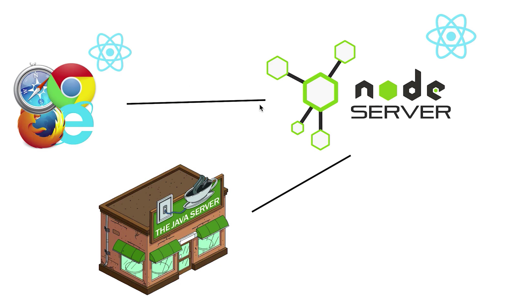

# 理论知识

## CSR流程

1. 浏览器发送请求
2. 服务器返回HTML
3. 浏览器发送bundle.js（构建工具编译、打包react代码后的js文件）请求
4. 服务器返回bundle.js
5. 浏览器执行bundle.js代码，通过js完成渲染

## SSR流程

1. 浏览器发送请求
2. 服务器运行react代码生成页面
3. 服务器返回页面

## react（Vue）支持服务端渲染引起的关于虚拟dom作用的思考

我们服务端渲染web应用程序的静态字符串时使用了`react-dom`提供的`renderToString`方法：

~~~javascript
import { renderToString } from "react-dom/server";
import Home from "./containers/Home";

// ...
const content = renderToString(<Home />); // 得到Home组件对应的字符串
// ...                              
~~~

其实`react`能提供`renderToString`这个方法，以及`Vue`提供`SSR`的能力，都是得益于虚拟dom体系的，所谓虚拟dom就是真实dom的一个`js`对象映射，所以我们可以在服务端（非浏览器环境下）获取真实dom的对应字符串，换句话说，`renderToString`方法，就相当于是虚拟dom到dom字符串的一个映射，它的实现，是离不开虚拟dom的。

新旧虚拟dom对比，可以更精确的对真实dom进行dom操作，从而提升渲染性能，但是，从上面可知，基于虚拟dom，使我们的`Vue`、`React`框架具有了更强的跨平台能力，专业点来说就是**虚拟dom解耦了 UI 的渲染和底层平台相关的细节**。就拿`Vue`的源码来说，`runtime-core`模块提供了`h`函数与`renderer`函数（`render`函数的工厂函数），而`runtime-dom`则提供了浏览器环境（平台）下dom渲染的具体细节以及基于这些细节的`render`函数实例。这就是为啥可以用`React ｜ Vue`开发浏览器、移动端、桌面应用、小程序的原因。

## CSR & SSR 利弊对比

基于ssr的角度来说，优点是显而易见的，首屏速度快和更好的seo支持。但是因为ssr时，React代码在服务器上执行，消耗的是服务器端的性能，所以最直接的缺点就是服务器负载大

## 同构

见本文目录：客户端搭建/总结

# webpack配置文件

* 因为我们的react项目是要在服务端打包并执行，js代码的运行环境是`node`环境，所以配置`target: "node"`表示打包输出`node`环境下运行的js代码。
* 使用`babel-loader`接入[Babel](https://juejin.cn/post/7223407070963187771)来处理`js`代码。
* 使用[webpack-node-externals](https://juejin.cn/post/7223644725835644989)插件进行构建优化。

# 开发体验优化

配置`package.json`实现热更新

~~~json
"scripts": {
  "dev": "npm-run-all --parallel dev:**",
  "dev:build": "webpack --config webpack.server.js --watch",
  "dev:start": "nodemon --watch build --exec node ./build/bundle.js"
},
~~~

首先`"dev:build"`命令即开启`webpack`的监听，打包范围内的文件有变动即重新打包；

`"dev:start"`命令即`nodemon`工具，`--watch`参数指定监听`build`文件夹下的文件变动，`--exec`指定后续执行的命令，即启动`node`服务

`dev`命令借助`npm-run-all`工具并行运行所有以`dev:`开头的命令，实现热更新。

热更新流程梳理：文件变动被`webpack`监听到，执行重新打包，从而`build`文件夹下打包产物发生改变，被`nodemon`监听到然后再次启动`node`服务。

# 客户端搭建

## 需求分析&思路确定

我们的项目说白了是一个`node`服务，通过`renderToString`方法将`React`代码转换为了对应的`html`字符串，然后通过模版字符串的形式嵌入到响应的`<html />`中，但是如果我们修改`react`代码，如`src/containers/Home/index.js`中给`<button>`添加事件回调，如下：

~~~react
import React from "react";

const Home = () => {
  return (
    

      home
      <button onClick={() => alert("click")}>click</button>
    

  );
};

export default Home;
~~~

这时候请求`node`服务发现事件是不生效的，原因就是`renderToString`方法只返回`React`代码对应的`html`结构，而对事件绑定等逻辑不做处理，这也非常好理解，`renderToString`方法运行在服务端`node`环境下，根本就没有dom这个概念，有怎么可能处理事件绑定呢。所以`renderToString`方法内部肯定在根据虚拟dom转字符串时把事件绑定等一些虚拟dom的属性忽略掉了，最终只生成了`html`结构。

我们现在的目标是让事件绑定相关的逻辑生效，中心思路很简单，利用`React`提供的相关方法，将我们的`react`业务代码进行处理，生成相应的处理事件绑定等逻辑的`js`文件，然后让客户端执行这个`js`文件，完成事件绑定。

## 搭建实践

首先给响应体中加一个`
        </body>
    </html>`
  );
});
~~~

我们通过`app.use(express.static("public"));`指定一个静态资源托管目录，当下需要做的事情就非常明确了——构造`js`文件，并存放在`public`文件夹下。

思路是创建一个`src/client`文件夹，其下`index.js`即为利用`React`提供的api生成js逻辑的地方，然后通过`webpack`对其进行处理，最终把打包后的产物命名为`index.js`并放在`public`文件夹下。

`src/client/index.js`

~~~js
import React from "react";
import { hydrateRoot } from "react-dom/client";

import Home from "../containers/Home";

hydrateRoot(document.getElementById("root"), <Home />); // 使用hydrateRoot方法生成客户端需要执行的js代码
~~~

然后再配置个`webpack.client.js`文件用于打包`src/client/`文件夹下的代码，最后再配置一下`package.json`里的`script`脚本，增加对`client`文件夹下内容的实时监听打包即可：

~~~json
"scripts": {
  "dev": "npm-run-all --parallel dev:**",
  "dev:build:server": "webpack --config webpack.server.js --watch",
  "dev:build:client": "webpack --config webpack.client.js --watch",
  "dev:start": "nodemon --watch build --exec node ./build/bundle.js"
}
~~~

## 总结

所谓服务端代码，即`src/index.js`，里面如`const content = renderToString(<Home />);`这属于服务端执行的`react`的逻辑，效果就是生成`react`代码对应的`html`静态结构。

所谓客户端（`src/client/`），其实就是让客户端（浏览器）去执行的`react`逻辑，即打包`src/client/index.js`生成的那个`js`文件，这个文件的执行，将会赋予`renderToString`方法生成的静态的`html`结构事件交互能力。

这里引出**同构**的概念，大致意思就是同一套`react`代码，当下这里就是指`Home`组件，服务端运行一次，即`renderToString`，客户端运行一次，即运行`"`，也就是服务端`src/client/index.js`打包生成的代码，核心逻辑就是`hydrateRoot`方法的调用。

# 引入路由同构

编写路由配置文件`Routes.js`，这就是我们常在`<App />`中写的路由配置部分：

~~~js
import React from "react";
import { Route, Routes as RouterRoutes } from "react-router-dom";
import Home from "./containers/Home";

const Routes = () => {
  return (
    <RouterRoutes>
      <Route path="/" element={<Home />} />
    </RouterRoutes>
  );
};

export default Routes;
~~~

客户端代码`@/client/index.js`，说白了就是曾经单页面应用中路由配置直接写`<Routes />`，现在用`<BrowserRouter />`组件包裹`<Routes />`：

~~~js
import React from "react";
import { hydrateRoot } from "react-dom/client";
import { BrowserRouter } from "react-router-dom";
import Routes from "../Routes";

const App = () => {
  return <BrowserRouter>{Routes()}</BrowserRouter>;
};

// 注意这里：hyrateRoot表示客户端代码的结构为在

中内层紧接着是由<BrowserRouter/>包裹的路由配置，所以下面服务端代码也要注意结构的统一
hydrateRoot(document.getElementById("root"), <App />);
~~~

服务端代码`@/server/index.js`：

~~~js
import express from "express";
import React from "react"; // 提供jsx语法支持
import { renderToString } from "react-dom/server";
import { StaticRouter } from "react-router-dom/server";
import Routes from "../Routes";

const app = express();
app.use(express.static("public"));

// 这里服务端接口路由修改为"*"以接收所有前端路由请求
app.get("*", (req, res) => {
  const content = renderToString(
    <StaticRouter location={req.path}>{Routes()}</StaticRouter>
  );
	// 下面的
中包裹的内容应该与客户端代码统一，也就是说里面紧接着就是路由配置，但是服务端的包裹<Routes />组件的是"react-router-dom/server"下面的<StaticRouter />组件，并需要将req.path提供给location属性
  res.send(
    `<html>
        <head>
            <title>hello</title>
        </head>
        <body>
            
${content}

            
        </body>
    </html>`
  );
});

app.listen(3000, () => {
  console.log("server run successfully");
});
~~~

# 抽取服务端字符串拼接的逻辑为`render`函数

`@/server/utils.js`：

~~~jsx
import React from "react"; // 提供jsx语法支持
import { renderToString } from "react-dom/server";
import { StaticRouter } from "react-router-dom/server";
import Routes from "../Routes";

export const render = (req) => {
  const content = renderToString(
    <StaticRouter location={req.path}>{Routes()}</StaticRouter>
  );
  return `
        <html>
            <head>
                <title>hello</title>
            </head>
            <body>
                
${content}

                
            </body>
        </html>
    `;
};
~~~

`@/server/index.js`：

~~~js
import express from "express";
import { render } from "./utils";

const app = express();
app.use(express.static("public"));

app.get("*", (req, res) => {
  res.send(render(req)); // 返回render函数的返回值即可
});

app.listen(3000, () => {
  console.log("server run successfully");
});
~~~

# ssr只支持首次渲染的路由

创建公共组件`<Header />`进行路由导航，`@/conponents/Header.js`：

~~~jsx
import React from "react";
import { Link } from "react-router-dom";

const Header = () => {
  return (
    

      <Link to="/">Home</Link>
       
      <Link to="/about">About</Link>
    

  );
};

export default Header;
~~~

并在两个路由组件`<About />`和`<Home />`中使用：

~~~jsx
// About.js
import React from "react";
import Header from "../../components/Header";

const About = () => {
  return (
    

      <Header />
      This is About page
    

  );
};

export default About;

// Home.js
import React from "react";
import Header from "../../components/Header";

const Home = () => {
  return (
    

      <Header />
      home
      <button onClick={() => alert("click1")}>click</button>
    

  );
};

export default Home;
~~~

打开浏览器，在`<Home />`或者`<About />`组件中我们都可以借助`<Link />`（编译为`<a />`）正常进行路由转跳，但是查看源代码发现，其实源代码一直都不变，都是我们在浏览器中首次请求的路由路径对应的组件的源代码，比如我请求`127.0.0.1:3000/about`，源码就是`<About />`组件所对应的，而请求`127.0.0.1:3000/`对应的源码就是`<Home />`组件的源码，然后应用程序内点击`<Link />`进行路由切换源码不变，**总结来说就是服务端渲染只发生在向服务端发送请求的时刻，后续web程序中的路由转跳将由js接管。**

# ssr项目架构

浏览器、node服务、C++/java服务三者各司其职，浏览器负责页面渲染与js的执行，资源从node服务里获取；node服务负责从java服务里获取数据然后与自己的react组件进行结合生成页面内容以及js；而C++/java服务器专注于底层的数据获取与计算（数据库操作），出于其高性能的考虑。

其中node服务作为整个架构的中间层，针对这种架构，可以单独增加node服务的数量来解决node服务的负载瓶颈，同时架构也有缺点，做单页面应用时我们只需要关注js代码的逻辑正确行（负责纯前端内容），但现在我们前端工程师需要考虑node服务的稳定性，比如node服务死机该如何处理等，相当于把前端工程师业务领域拓展到了运维（后端）等领域。

# 引入Redux

## 初步引入（跑通代码并使用redux）

总体思路：只需要在`@/client/index.js`与`@/server/index.js`使用`redux`并且保证同构的逻辑相同即可，说白了就是给客户端的`<BrowserRouter />`和服务端的`<StaticRouter />`用`<Provider />`包裹即可，然后组件内使用`redux`提供的数据即可。分析一下为啥需要在`@/client/index.js`和`@/server/utils.js`中写基本相同的逻辑代码，而组件中使用`redux`数据就不存在代码逻辑的重复：

原因很简单，我们的核心原则就一个：`server`中通过`renderToString`方法构造并响应的`html`字符串内容所依赖的react项目结构与`client`中`hydrateRoot`生成js所依赖的react项目结构要相同，因为`server`中路由组件使用的是`<StaticRouter />`而`client`中路由组件使用的是`<BrowserRouter />`，由于他俩的结构不同，外面要加一个`<Provider />`的话代码是无法复用的，所以只能两个地方都进行修改，然后路由组件是复用的（`server`和`client`都在使用），所以路由组件中使用`redux`的逻辑只需要写一遍即可。

`@/client/index.js`：

~~~jsx
import { BrowserRouter } from "react-router-dom";
import Routes from "../Routes";
import { createStore } from "redux";
import { Provider } from "react-redux";

+ const reducer = (state = { name: "daxt" }, action) => {
+   return state;
+ };

+ const store = createStore(reducer);

const App = () => {
  return (
+   <Provider store={store}>
      <BrowserRouter>{Routes()}</BrowserRouter>
+   </Provider>
  );
};

hydrateRoot(document.getElementById("root"), <App />);
~~~

`@/server/utils.js`：

~~~jsx
import React from "react"; // 提供jsx语法支持
import { renderToString } from "react-dom/server";
import { StaticRouter } from "react-router-dom/server";
import Routes from "../Routes";
+ import { createStore } from "redux";
+ import { Provider } from "react-redux";

export const render = (req) => {
+ const reducer = (state = { name: "daxt" }, action) => {
+   return state;
+ };
+ const store = createStore(reducer);

  const content = renderToString(
+   <Provider store={store}>
      <StaticRouter location={req.path}>{Routes()}</StaticRouter>
+   </Provider>
  );
  return `
        <html>
            <head>
                <title>hello</title>
            </head>
            <body>
                
${content}

                
            </body>
        </html>
    `;
};
~~~

`@/containers/Home/index.js`：

~~~jsx
import React from "react";
import Header from "../../components/Header";
import { connect } from "react-redux"; // 通过connect生成高阶函数来将store中的state（dispatch）增强到props中使用即可

const Home = (props) => {
  return (
    

      <Header />
      home: This is a data -- "{props.name}" from redux
      <button onClick={() => alert("click1")}>click</button>
    

  );
};

const mapStateToProps = (state) => ({
  name: state.name,
});

export default connect(mapStateToProps, null)(Home);
~~~

plus：由于`server`端与`client`端都存在`createStore`的逻辑，所以如果使用`redux-thunk`这种中间件也就需要分别在两端书写相关逻辑。

## 抽取公共逻辑（`store`相关）

`@/client/index.js`：

~~~jsx
import React from "react";
import { hydrateRoot } from "react-dom/client";
import { BrowserRouter } from "react-router-dom";
import Routes from "../Routes";
- import { createStore, applyMiddleware } from "redux";
import { Provider } from "react-redux";
- import thunk from "redux-thunk";

- const reducer = (state = { name: "daxt" }, action) => {
-  return state;
- };
  
+ import store from "../store";

- const store = createStore(reducer, applyMiddleware(thunk));

const App = () => {
  return (
    <Provider store={store}>
      <BrowserRouter>{Routes()}</BrowserRouter>
    </Provider>
  );
};

hydrateRoot(document.getElementById("root"), <App />);
~~~

服务端代码同理，删除所有创建`store`相关的逻辑，改为从`@/store/index.js`中引入，`@/server/utils.js`：

~~~jsx
import React from "react"; // 提供jsx语法支持
import { renderToString } from "react-dom/server";
import { StaticRouter } from "react-router-dom/server";
import Routes from "../Routes";
- import { createStore, applyMiddleware } from "redux";
import { Provider } from "react-redux";
- import thunk from "redux-thunk";

+ import store from "../store";

export const render = (req) => {
- const reducer = (state = { name: "daxt" }, action) => {
-   return state;
- };
- const store = createStore(reducer, applyMiddleware(thunk));

  const content = renderToString(
    <Provider store={store}>
      <StaticRouter location={req.path}>{Routes()}</StaticRouter>
    </Provider>
  );
  return `
        <html>
            <head>
                <title>hello</title>
            </head>
            <body>
                
${content}

                
            </body>
        </html>
    `;
};
~~~

新建`@/store/index.js`：

~~~js
+ import { createStore, applyMiddleware } from "redux";
+ import thunk from "redux-thunk"; 

+ const reducer = (state = { name: "daxt" }, action) => {
+  return state;
+ };
+ const store = createStore(reducer, applyMiddleware(thunk));

+ export default store;
~~~

## store单例模式坑点

当前node服务使用的都是`@/store/index.js`中创建的唯一的一个`store`对象，所以会导致所有用户共享同一个`store`，所以要对`@/store/index.js`做出如下修改：

~~~js
import { createStore, applyMiddleware } from "redux";
import thunk from "redux-thunk";

const reducer = (state = { name: "daxt" }, action) => {
  return state;
};

- const store = createStore(reducer, applyMiddleware(thunk));

+ const getStore = () => {
+  return createStore(reducer, applyMiddleware(thunk));
+ };
  
- export default store;
  
+ export default getStore;
~~~

同时在客户端以及服务端代码中给`<Provider />`传递`store`实例时调用`getStore`方法，即`<Provider store={getStore()}>`

## redux中异步数据的服务端渲染

修改当前的`@/store/index.js`，创建模块化的`store`实例：

~~~js
import { createStore, applyMiddleware, combineReducers } from "redux";
import thunk from "redux-thunk";
import { reducer as homeReducer } from "../containers/Home/store"; // 引入具体组件的reducer实例

// combineReducers创建模块化store
const reducer = combineReducers({
  home: homeReducer,
});

const getStore = () => {
  return createStore(reducer, applyMiddleware(thunk));
};

export default getStore;
~~~

`@/containers/Home/store`：

~~~jsx
// index.js
import reducer from "./reducer";

export { reducer };

// reducer.js
import { CHANGE_HOME_LIST } from "./constants";

const defaultState = {
  data: "home data",
};

export default (state = defaultState, action) => {
  switch (action.type) {
    case CHANGE_HOME_LIST:
      return {
        ...state,
        data: action.data,
      };
    default:
      return state;
  }
};

// constants.js
export const CHANGE_HOME_LIST = "change_home_list";

// actions.js
import { CHANGE_HOME_LIST } from "./constants";
import axios from "axios";

export const changeHomeData = (data) => ({
  type: CHANGE_HOME_LIST,
  data,
});

export const getHomeData = () => { // 通过ajax异步获取服务端数据data，并调用changeHomeData(data)创建action后dispatch
  return (dispatch) => {
    axios.get("http://127.0.0.1:80").then((res) => {
      const homeData = res.data;
      dispatch(changeHomeData(homeData));
    });
  };
};
~~~

`@/containers/Home/index.js`：

~~~jsx
import React, { useEffect } from "react";
import Header from "../../components/Header";
import { connect } from "react-redux";
import { getHomeData } from "./store/actions";

const Home = (props) => {
  // 组件挂载之初调用props.getHomeData，相当于触发异步请求的逻辑从服务端获取数据
  useEffect(() => {
    const { getHomeData } = props;
    getHomeData();
  }, []);

  return (
    

      <Header />
       
      {/* 将store中的数据增强到props中后进行展示 */}
      {props.data}
    

  );
};

const mapStateToProps = (state) => ({
  data: state.home.data,
});

const mapDispatchToProps = (dispatch) => ({
  getHomeData() {
    dispatch(getHomeData());
  },
});

export default connect(mapStateToProps, mapDispatchToProps)(Home);
~~~

上诉代码的运行效果是在客户端请求了node服务后，通过js代码的执行向`127.0.0.1:80`（本地跑的另一个服务端项目，用来充当后端数据服务器）发送网络请求，同样通过js的执行对页面进行渲染，即展示出请求获取的异步数据。

### 当前需要解决的问题：

1. 异步数据并不是在`node`服务中渲染出来的，也就是说页面源代码中并没有对异步数据进行ssr
2. `node`服务此时并没有充当中间层的作用，也就是说客户端请求的目的地址仍直接是远程数据服务器。

### 项目架构梳理（插曲）

服务端代码，也就是基于`express`框架的`node`服务，打包后生成`/build/bundle.js`，我们启动项目也相当于用`node`命令运行这个`bundle.js`；客户端代码打包后的产物是`/public/index.js`，也就是生成的去“激活”静态结构的js逻辑。

我们的`node`服务通过`express.static("public")`中间件托管`public`文件夹下的资源，相当于托管了客户端“激活”静态结构要执行的js代码，而用户通过浏览器请求到的`html`资源并不是一个真正的`html`文件，而是后端返回的`html`字符串，到了浏览器渲染出了页面（对浏览器来说接收到`<html />`字符串等价于访问一个`.html`文件）。

联系：浏览器上渲染出的`html`页面里面有`<script>`标签，`src`指向的请求地址为`index.js`，即访问到了服务器上的托管的`public`文件夹下的用于“激活”静态结构的js代码，所以这里存在一个网络请求，即向`node`服务请求`index.js`文件。概括一下就是，我们的项目，说白了就是一个`node`服务端项目，然后向我们的`node`服务发请求会返回`html`字符串（浏览器收到`html`字符串等价于接收到`.html`文件），浏览器对`html`进行渲染并执行，因为里面的存在一个`<script src="index.js">`所以会触发浏览器向服务器的再一次请求，即请求`index.js`文件。

### 修复favicon.ico缺失造成的空请求问题（插曲）

上面说到，我们的浏览器收到`html`字符串与收到`.html`文件是等价的，都会根据`html`文件去执行渲染以及一些网络请求，浏览器有一个默认行为，就是在收到一个`html`文件时，会向请求的地址，也就是返回`html`文件的地址（当然也可能是一个返回`html`字符串的后端接口）为基本路径，请求`./favicon.ico`资源，作为浏览器页签最左边的小图标。

请求我们的`node`服务地址下的`favicon.ico`资源，因为我们托管静态资源的的`public`文件夹下并没有这个资源，进而也就进入了`app.get("*", () => {})`接口请求的逻辑中，所以服务端会给出没有对应的`favicon.ico`路由的提示，修复方法就是在`public`文件夹下放一个名`favicon.ico`的小图片即可。

### 异步数据ssr的实现思路

可以注意到`@/containers/Home/store/reducer.js`中初始化仓库数据时`defaultState`给`data`值设置了一个`"home data"`作为初始值，然后打开浏览器的源代码，`"home data"`是成功出现在源码中的，也就是成功进行了ssr。

我们的思路就非常明确了：**在服务端代码部分，给`renderToString`传参之前，把异步数据成功存入`store`中即可，这样`renderToString`就能顺利渲染出`store`中的数据并返回给客户端。**